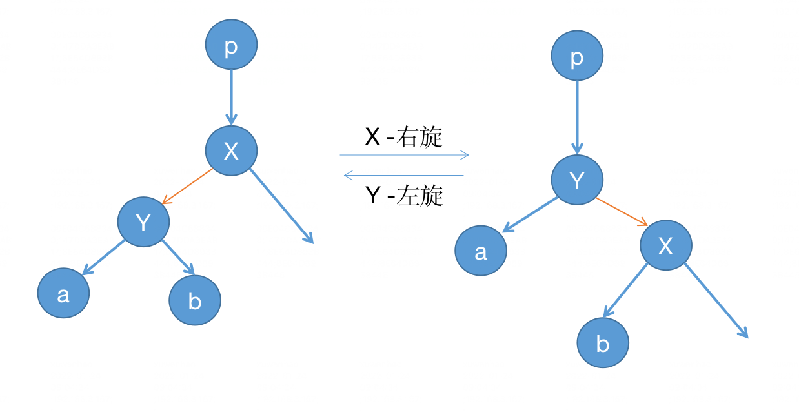

# 红黑树
## 从二叉平衡树到红黑树
如果在一棵普通的二叉树上查找搜索某个元素结点，每一个节点都需要遍历，需要 O(n) 的时间复杂度。

为了提高搜素效率，可以在二叉树的左子节点，根节点，右子节点这三个节点中，维护他们的关系，于是有了二叉搜索树（BST）。

二叉搜索树的性质如下：
- 若它的左子树不空，则左子树上所有结点的值均小于它的根结点的值
- 若它的右子树不空，则右子树上所有结点的值均大于它的根结点的值
- 它的左、右子树也分别为二叉排序树

BST 搜索的时间复杂度为 $O(\log n)$，但是构造 BST 时如果不加约束，容易退化为链表，查询效率变为 $O(n)$。

BST 插入节点时直接根据叶子节点的大小对比，找到合适的位置，加入即可。

一棵对查询友好的二叉树，应该是一个平衡或者接近平衡的二叉树，平衡二叉搜索树（Balanced BST）的核心目标是通过约束树的结构，保证操作（查找、插入、删除）的时间复杂度稳定在 $O(\log n)$。

常见的平衡搜索树，如 AVL 树，引入自平衡机制，保证每个节点的左右子树高度差（平衡因子）绝对值不超过1。但该平衡过程需要额外 $O(\log n)$ 时间维护平衡。

另一种平衡搜索树，红黑树，通过旋转+颜色调整维护平衡，比 AVL 树旋转次数更少，维护成本稍低。树的高度至多为 $2log(n+1)$，查询效率略逊于 AVL 树，但更新更快。

## 红黑树
RB 树通过颜色标记（红/黑）和规则约束，保证树的高度近似平衡，具有以下特性：
1. 每个节点或者是黑色，或者是红色
2. 根节点和叶子节点都是黑色（这里的叶子节点指为空(NULL)的叶子节点）
3. 红色节点的父节点是黑色节点（说明红色节点的父节点，左子节点，右子节点都只能是黑色节点，红色与红色不能直接相连，而黑色节点不管红黑节点都可以直接相连）
4. 从一个节点到该节点的子孙节点的所有简单路径上包含相同数目的黑节点（也称为黑平衡）

由性质 3 和 4 共同决定了：**最长的路径的节点总数量不会超过最短的路径的两倍**，因此可以让红黑树不至于严重失衡。

## 红黑树平衡
红黑树是搜索二叉树，因此插入的时候，会先找到适合的位置先挂上，然后再调整，调整过程也称为平衡过程。

平衡过程有两点：
- 旋转：左旋和右旋
- 变色：黑变红，或红变黑

变色本身简单，需要结合旋转过程来看，变色是为了符合红黑树的几个特性，旋转如下图：



旋转后，其实二叉搜索树的左子节点小于根节点，根节点小于右子节点这个特性其实没有变，**变化的是两个子树的高度**。

右旋过程: X 是主角，X 右旋，具体为：X 旋转为其左子节点 Y 的右节点，这个时候 Y 有两个右子节点，之前的右子节点 b 需要送给 X 作为左节点。( X 之前的左节点是 Y)

Java 的 TreeMap 就是用红黑树实现的，可以看到右旋的代码：
```java
// 对 p 节点右旋
private void rotateRight(Entry<K,V> p) {
    if (p != null) {
        // 取 p 的左子节点 Y
        Entry<K,V> l = p.left;
        // 将左子节点的右子树，也就是b，送过来当右子树
        p.left = l.right;
        // 修改 b 的父节点为 p
        if (l.right != null) l.right.parent = p;
        // p 的父节点变为 Y 的父节点
        l.parent = p.parent;
        if (p.parent == null)
            root = l; // 原 p 是根节点，现 Y 为根节点
        // 根据 p 是其父节点的右子节点或左子节点，现将 p 改为 Y    
        else if (p.parent.right == p)
            p.parent.right = l;
        else p.parent.left = l;
        l.right = p; // p 变成 Y 的右子节点
        p.parent = l; // p 的父节点为 Y
    }
}
```
左旋过程: Y 是主角，Y 左旋，具体为：Y 旋转为其右子节点 X 的左节点，这个时候 X 有两个左子节点，之前的左子节点 b 需要送给 Y 作为右节点。(Y 之前的左节点是 X)

左旋的代码也类似：
```java
private void rotateLeft(Entry<K,V> p) {
    if (p != null) {
        Entry<K,V> r = p.right;
        p.right = r.left;
        if (r.left != null)
            r.left.parent = p;
        r.parent = p.parent;
        if (p.parent == null)
            root = r;
        else if (p.parent.left == p)
            p.parent.left = r;
        else
            p.parent.right = r;
        r.left = p;
        p.parent = r;
    }
}
```
可以发现高度变化：
- 右旋：左子树高度 -1，右子树高度 +1
- 左旋：右子树高度 -1，左子树高度 +1

## 插入操作
红黑树的插入相较于二叉搜索树，多了平衡动作，包括旋转和变色。

新插入的节点，都使用红色，因为使用黑色，可能破坏性质 4，即改变路径黑节点数，破坏平衡，调整代价大，而使用红色，黑色节点数没变，只有在父节点是红色时才需要进一步调整，情况更可控。

假设插入的新节点是 C，当前平衡节点也是 C，假设它的父节点为 P，祖父节点为 GP，父节点的兄弟节点为叔叔节点 U。将 C 初始化为红色，插入的情况大致分为以下几种：
1. C 是根节点，要涂为黑色
2. C 的父节点是黑色，性质 3 和 4 都满足，不需要操作。
3. C 的父节点是红色，叔叔节点是红色的，将 C 的父节点 P 和 叔叔节点 U 涂成黑色，保证当前节点和上一层不是红色和红色相连，但是再往上到祖父节点需要作为新的平衡节点 C，递归处理。
4. C 的父节点是红色，C 的叔叔节点是黑色：
   1. 父节点和 C 是同一边：
      1. 父节点和当前节点 C 都是左子节点：以 GP 为主角右旋，将原来节点 P 涂黑，原来的 GP 涂成红色
      2. 父节点和当前节点 C 都是右子节点：以 GP 为主角左旋，将原来节点 P 涂黑，原来的 GP 涂成红色
   2. 父节点和 C 不是同一边：
      1. 父节点是左子节点，但是 C 是右子节点： 以 P 为主角左旋，左旋之后变成了 4.1.1 的情况，父节点和 C 都在左子节点，按照 4.1.1 情况继续处理。
      2. 父节点是右子节点，但是 C 是左子节点： 以 P 为主角右旋，右旋之后变成了 4.1.2 的情况，父节点和 C 都在右子节点，按照 4.1.2 情况继续处理。

代码可以参考 TreeMap 中的插入后平衡代码：
```java
private void fixAfterInsertion(Entry<K,V> x) {
    x.color = RED;

    // 只有父节点为红色时才调整(将破坏向上传递)
    while (x != null && x != root && x.parent.color == RED) {
        // 父节点是祖父节点的左节点
        if (parentOf(x) == leftOf(parentOf(parentOf(x)))) {
            // 取叔叔节点 y
            Entry<K,V> y = rightOf(parentOf(parentOf(x)));
            // 父节点和叔叔节点都是红色，即情况 3
            if (colorOf(y) == RED) {
                setColor(parentOf(x), BLACK);
                setColor(y, BLACK);
                setColor(parentOf(parentOf(x)), RED);
                x = parentOf(parentOf(x));
            } else {
                // x 与父节点不在同一边，即情况 4.2.1
                if (x == rightOf(parentOf(x))) {
                    x = parentOf(x);
                    rotateLeft(x);
                }
                // x 与父节点在同一边，即情况 4.1.1
                setColor(parentOf(x), BLACK);
                setColor(parentOf(parentOf(x)), RED);
                rotateRight(parentOf(parentOf(x)));
            }
        } else {
            // 与上面是对称的操作
            Entry<K,V> y = leftOf(parentOf(parentOf(x)));
            if (colorOf(y) == RED) {
                setColor(parentOf(x), BLACK);
                setColor(y, BLACK);
                setColor(parentOf(parentOf(x)), RED);
                x = parentOf(parentOf(x));
            } else {
                if (x == leftOf(parentOf(x))) {
                    x = parentOf(x);
                    rotateRight(x);
                }
                setColor(parentOf(x), BLACK);
                setColor(parentOf(parentOf(x)), RED);
                rotateLeft(parentOf(parentOf(x)));
            }
        }
    }
    root.color = BLACK;
}
```

## 删除操作
### 二叉搜索树的删除
先看二叉搜素树的删除操作，根据节点的子节点情况分三种情况处理：
1. 被删除节点是叶子节点：直接删除该节点，父节点对应指针置空。
2. 被删除节点有一个子节点：将父节点指向被删除节点的子节点。
3. 被删除节点有两个子节点：
   1. 找到右子树的最小节点，即后继节点（或左子树的最大节点，即前驱节点）
   2. 用该节点的值替换被删除节点的值
   3. 删除原最小/最大节点（该节点必为叶子或只有一个子节点，转化为前两种情况）

### 红黑树的删除
对于红黑树的删除，也是类似，先删除，再调整。对于那几个特性：
- 如果删除的是红色节点，没有影响
- 如果删除的是黑色节点，需要调整满足特性。

先看 Java 中 TreeMap 的删除过程：
```java
private void deleteEntry(Entry<K,V> p) {
    modCount++;
    size--;

    // 两个子树都不为空
    if (p.left != null && p.right != null) {
        // 找右子树中最小的节点，即查找右子树的最左节点，或者往上查询符合右子节点的父节点 s（称之为顶替节点）
        Entry<K,V> s = successor(p);
        // 将 s 的值替换掉要被删除的节点
        p.key = s.key;
        p.value = s.value;
        // 这个并不是真的删除，只是将p指向了顶替节点
        p = s;
    }

    // 顶替节点被用来补被删除的节点位置了，那它自己的位置需要用左子节点或者右子节点补上（称之为顶替节点的候选节点）
    Entry<K,V> replacement = (p.left != null ? p.left : p.right);

    // 如果顶替节点至少有一个子树，那就肯定有候选节点
    if (replacement != null) {
        // 候选节点关联到顶替节点的父节点上（维护父子关系）
        replacement.parent = p.parent;
        if (p.parent == null)
            root = replacement;
        else if (p == p.parent.left)
            p.parent.left  = replacement;
        else
            p.parent.right = replacement;

        // 顶替节点相当于被删掉了
        p.left = p.right = p.parent = null;

        // 如果顶替节点是黑色的，那么需要平衡调整了
        if (p.color == BLACK)
            fixAfterDeletion(replacement);
    } else if (p.parent == null) {
        // 顶替节点既无子节点，也无父节点，说明树中只有这一个节点
        root = null;
    } else {
        // 用来顶替的节点没有左右子树
        // 黑色节点，需要平衡调整
        if (p.color == BLACK)
            fixAfterDeletion(p);

        // 直接删除 p
        if (p.parent != null) {
            if (p == p.parent.left)
                p.parent.left = null;
            else if (p == p.parent.right)
                p.parent.right = null;
            p.parent = null;
        }
    }
}
```
删除节点时，分为三种情况：
1. 该节点有两个子节点，需要找到后继节点（s），将其值复制到当前节点，并指向后继节点（此时当前节点 p 最多只有一个子树，即变成第二种情况）
2. 该节点只有有一个子节点，直接将该子节点（即 replacement）替换到当前节点位置
3. 该节点没有子节点，直接删除该节点

可以看出，删除的过程，主要涉及到三个节点：
- 待删除节点：需要删掉，但不是真的删掉，而是用顶替节点的值直接赋值
- 顶替节点：顶替节点用来顶替待删除节点，值被写到待删除节点的位置，但是它原来的位置需要删掉（只有左右子树都存在时才需要顶替节点）
- 顶替节点的候选节点：是顶替节点的左/右子节点，因为顶替节点的值被放到待删除节点中，因此，顶替节点需要被删除，需要候选节点顶上去。

其中寻找后继节点，即顶替节点的方法 `successor()`，后继节点是大于当前节点 t 的最小节点，也就是中序遍历中 t 的下一个节点。分为两种情况：
- t 有右子树，后继一定是右子树中最左的节点（根据标准 BST 查找方式）。
- t 没有右子树，要向上走找后继，因为当前节点 t 是某条路径中最右边的节点，后继不在它的右边了，只能在它祖先里比它大的那个。

代码解析如下：
```java
static <K,V> TreeMap.Entry<K,V> successor(Entry<K,V> t) {
    if (t == null)
        return null;
    // t 有右子树
    else if (t.right != null) {
        // 找右子树中最左的节点
        Entry<K,V> p = t.right;
        while (p.left != null)
            p = p.left;
        return p;
    // t 无右子树
    } else {
        Entry<K,V> p = t.parent;
        Entry<K,V> ch = t;
        // 如果当前节点是某个祖先的右孩子，就往上爬
        // 一直到第一次是作为左孩子的节点为止
        while (p != null && ch == p.right) {
            ch = p;
            p = p.parent;
        }
        // 那个父节点就是后继
        return p;
    }
}
```
可以看到，红黑树中找替代节点是使用的后继节点，没有使用前驱节点(predecessor)，无论选择 successor 还是 predecessor 来替代待删除的节点，都能保持 BST 的有序性，这里红黑树实现偏向使用 successor。（可能因为后继节点最多一个右子节点，即无左子节点，处理逻辑简单）

还可以注意到，删除思路是不删除目标数据，而是找到目标数据的后继节点，然后把数据拷贝一份到目标数据进行覆盖。然后转而去删除后继，删除后再去修补平衡。

删除节点的时候，只有删除黑色节点才需要调整平衡，调整的思路是引入“双重黑”基本情况，通过旋转和重新着色，将双重黑节点逐步上移或消除。假设删除的后继节点是 x，x 是黑色节点，存在以下几种情况：
1. x 的兄弟 sib 是红色的
2. x 的兄弟 sib 是黑色的，且 sib 的两个子节点都是黑色
3. x 的兄弟 sib 是黑色的，sib 的左子节点是红色，右子节点是黑色（x 是其父节点的左子）
4. x 的兄弟 sib 是黑色的，且 sib 的右子节点是红色（x 是其父节点的左子）

另外还有情况 5/6，是当 x 是其父节点的右子时情况 3/4 的镜像对称。结合调整方法 `fixAfterDeletion()` 分析：
```java
private void fixAfterDeletion(Entry<K,V> x) {
    while (x != root && colorOf(x) == BLACK) {
        // 当 x 是左子节点
        if (x == leftOf(parentOf(x))) {
            Entry<K,V> sib = rightOf(parentOf(x)); // 兄弟节点

            // 情况 1：兄弟节点是红色，处理成下面的情况2，3，4
            if (colorOf(sib) == RED) {
                // 兄弟设置为黑色，父节点设置为红色，左旋父节点
                setColor(sib, BLACK);
                setColor(parentOf(x), RED);
                rotateLeft(parentOf(x));
                // 更新兄弟节点
                sib = rightOf(parentOf(x));
            }

            // 情况 2：兄弟节点的子节点都是黑色
            if (colorOf(leftOf(sib))  == BLACK &&
                colorOf(rightOf(sib)) == BLACK) {
                // 将兄弟节点变红
                setColor(sib, RED);
                // 向上传递
                x = parentOf(x);
            } else {
                // 情况 3：兄弟节点的右子节点是黑色
                if (colorOf(rightOf(sib)) == BLACK) {
                    // 兄弟节点的左子节点也变黑
                    setColor(leftOf(sib), BLACK);
                    // 兄弟节点变红
                    setColor(sib, RED);
                    rotateRight(sib);
                    sib = rightOf(parentOf(x));
                }
                // 情况 4：兄弟节点的右子节点已经是红色
                setColor(sib, colorOf(parentOf(x)));
                setColor(parentOf(x), BLACK);
                setColor(rightOf(sib), BLACK);
                rotateLeft(parentOf(x));
                x = root; // 直接结束
            }
        } else { // symmetric
            Entry<K,V> sib = leftOf(parentOf(x));

            if (colorOf(sib) == RED) {
                setColor(sib, BLACK);
                setColor(parentOf(x), RED);
                rotateRight(parentOf(x));
                sib = leftOf(parentOf(x));
            }

            if (colorOf(rightOf(sib)) == BLACK &&
                colorOf(leftOf(sib)) == BLACK) {
                setColor(sib, RED);
                x = parentOf(x);
            } else {
                if (colorOf(leftOf(sib)) == BLACK) {
                    setColor(rightOf(sib), BLACK);
                    setColor(sib, RED);
                    rotateLeft(sib);
                    sib = leftOf(parentOf(x));
                }
                setColor(sib, colorOf(parentOf(x)));
                setColor(parentOf(x), BLACK);
                setColor(leftOf(sib), BLACK);
                rotateRight(parentOf(x));
                x = root;
            }
        }
    }

    setColor(x, BLACK);
}
```
由于删除了一个黑色节点，树中某个路径“少了一个黑”，所以需要想办法把这个“黑色”通过借、旋、传递的方式补回来：
- 兄弟红色：先旋转结构（变成黑色情况）；
- 兄弟黑色但无红子：传递黑色给父节点；
- 兄弟黑色，子结构不理想：先旋转变理想；
- 兄弟黑色，有红子：一次旋转彻底修复。

