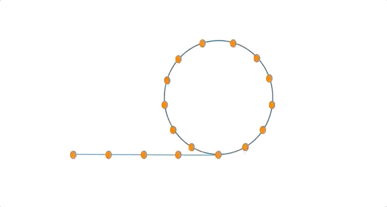
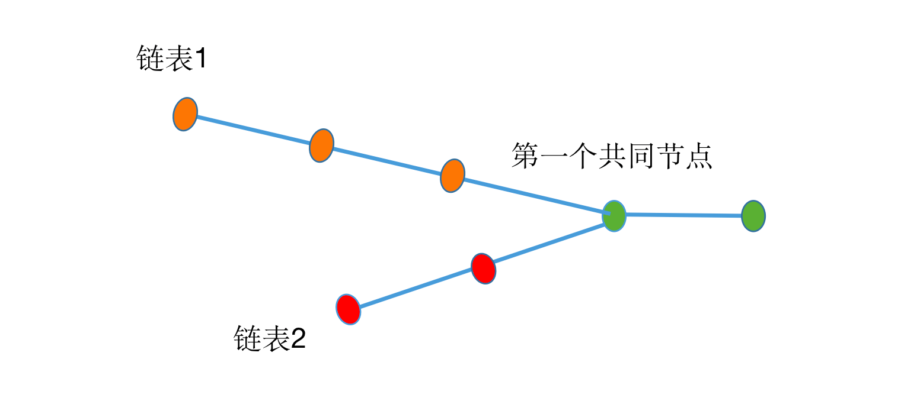

# 数组和链表
## 约瑟夫环问题
著名的约瑟夫问题：编号为 1-N 的 N 个士兵围坐在一起形成一个圆圈，从编号为 1 的士兵开始依次报数（1，2，3... 这样依次报数），数到 m 的 士兵会被淘汰出列，之后的士兵再从 1 开始报数。直到最后剩下一个士兵，求这个士兵的编号。

假设使用数组解决该问题，用一个长度为 N 的数组，索引表示 0～N-1 标号，要求返回最后一个士兵的编号。思路如下：
1. 初始化剩余的士兵数 remain 为 n，重复下面操作，直到全部士兵淘汰。
2. 初始化 count = 0，从第一个士兵开始计数，每次遍历到数值不为 -1 的元素，则 count+1，如果 count = m，说明该士兵需要被淘汰出局，则元素的值置为 -1，淘汰的数量 remain - 1，且 count 重新赋值为 0。
3. 最后 remain = 0 时，此时的索引值便是最后剩下的士兵。

代码实现如下：
```java
public static int josephus(int n, int m) {
    int[] peoples = new int[n];
    int index = -1; // 开始索引
    int remain = n; // 环中剩余的人
    int count = 0; // 循环数0-m
    while(remain > 0) {
        index++;
        if(index == n)
            index = 0;
        // 跳过淘汰的人
        if(peoples[index] == -1)
            continue;
        else {
            count++;
            if(count == m) {
                peoples[index] = -1;
                remain--;
                count = 0;
            }
        }
    }
    return index;
}
```

## 生成滑动窗口最大值数组
假设给定一个整形数组 nums 和一个大小为 k 的窗口，k 小于 nums 的长度，窗口从数组的最左边，每次滑动一个数，一直到最右边，返回每次滑动窗口中的最大值的数组。

假设输入数组为 `{3, 5, -1, 3, 2, 5, 1, 6}`，窗口大小为 k = 3，滑动窗口具体如下，`[]`中即滑动窗口的内容：
```
[ 3  5  -1]  3  2  5  1  6       5
  3 [5  -1   3] 2  5  1  6       5
  3  5 [-1   3  2] 5  1  6       3
  3  5  -1 [ 3  2  5] 1  6       5
  3  5  -1   3 [2  5  1] 6       5
  3  5  -1   3  2 [5  1  6]      6
```
首先是暴力解法，即每个窗口都遍历一次，找出最大值：
```java
public static int[] maxSlidingWindow_Naive(int[] nums, int k) {
    if(nums.length == 0 || k == 0)
        return new int[0];
    int[] result = new int[nums.length - k + 1];
    for(int i = 0; i < nums.length - k + 1; i++) {
        int max = nums[i];
        for(int j = i; j < i + k; j++) {
            max = Math.max(max, nums[j]);
        }
        result[i] = max;
    }
    return result;
}
```
假设数组的大小为 n，窗口的大小为 k，那么滑动窗口个数就为 n-k+1，每次窗口比较获取最大数需要 k 次，所以一共要比较 k*(n-k+1) 次，时间复杂度为 O(n*k)，空间复杂度为 O(N−k+1)。

要优化时间复杂度，需要以空间换时间，使用到双向队列，不需要每次全部统计新的滑动窗口的的最大值，只需要把更大值的索引不断地保存在队列的队尾中。具体思路如下：（队列中存的是数组的索引下标）
1. 遍历数组 nums 中的元素 nums[i]，执行以下操作。
2. 队列的头部是最小元素，当队列不为空时，比较队列头的元素是否小于 nums[i]，若是，则移除元素，直到队列头的元素大于 nums[i]。即删除队列中较小的元素索引。
3. 将当前元素索引 i 添加到队列头部。
4. 移除队列尾部已经不在窗口中的元素，即如果队列尾部元素小于等于 i-k，则移除尾部元素。
5. 若当前索引达到窗口的大小，即 i=k-1 时，开始记录窗口中的最大值，即队列尾部元素。

以数组 `{3, 5, -1, 3, 2, 5, 1, 6}`，窗口大小 k = 3 为例：


代码如下：
```java
public static int[] maxSlidingWindow_Queue(int[] nums, int k) {
    int n = nums.length;
    if(nums.length == 0 || k == 0)
        return new int[0];
    int[] result = new int[n - k + 1];
    // 双向队列
    LinkedList<Integer> queue = new LinkedList<>();
    for(int i = 0; i < n; i++) {
        // 移除队列中较小元素
        while(!queue.isEmpty() && nums[i] > nums[queue.getFirst()])
            queue.pollFirst();
        // 添加当前元素
        queue.offerFirst(i);
        // 移除不在窗口内的元素
        if(queue.getLast() <= i - k)
            queue.pollLast();
        // 当前索引大于等于窗口大小时，记录最大元素
        if(i - k >= -1)
            result[i - k + 1] = nums[queue.getLast()];
    }
    return result;
}
```
该算法最差的情况就是所有元素都进入队列，因此空间复杂度为 O(n)，而最差的情况即所有的元素都进入队列之后，又挨个出队列，加入有 n 个元素，那么就进入队列和出队列的次数就是 2n，因此时间复杂度就是 O(2n)=O(n)。

## 找链表的倒数 k 个元素
定义链表的节点为 ListNode，里面包含了一个属性 val，表示当前节点的值，而另一个属性 next 则表示当前节点的下一个节点的引用，定义如下：
```java
class ListNode {
    int val;
    ListNode next;

    ListNode(int val) {
        this.val = val;
    }
}
```
如果访问链表的顺序第 k 个节点，一般是给出头结点的引用，直接循环 k--，若当前节点下一个不为 null，则向后移动一位，直到 k = 1 结束：
```java
static ListNode findKNode(ListNode head, int k) {
    ListNode node = head;
    while(k > 1) {
        if(node != null)
            node = node.next;
        k--;
    }
    return node;
}
```
但是如果改为获取倒数第 k 个元素，最简单的方法是先用一个指针从头到尾走完，得到链表的长度，然后再使用一个指针又从头开始，走到 n-k+1 的位置，就是倒数第 k 个元素。这样需要遍历两次。

我们可以让两次遍历一起进行，即两个指针，一前一后，让第 1 个指针先走 k 步，然后第 2 个指针开始与第 1 个指针一起走，直到第 1 个指针走到最后的位置，此时第 2 个指针停留的位置就是倒数第 k 个元素，具体代码如下：
```java
static ListNode findLastKNode(ListNode head, int k) {
    if(head == null || k < 0)
        return null;
    ListNode first = head, last = head;
    // 第一个指针先走 k 步
    while(k > 0) {
        if(first != null)
            first = first.next;
        k--;
    }
    // 两个指针一起走
    while(first != null) {
        first = first.next;
        last = last.next;
    }
    return last;
}
```

## 判断一个链表是否有环
有两种情况：一种是链表整体就是个环，即环形链表，一种是局部形成环。问题是给出链表的头节点，判断链表是否有环。

最直接的方法是使用 HashSet，只需要遍历时判断是否成功加入该节点，若成功加入就后移指针，若添加节点失败，说明有环，返回 true，如果遍历到 null 节点，遍历结束，没有找到相同节点，即没有环的存在，返回 false：
```java
static boolean isContainCycle_naive(ListNode head) {
    HashSet<ListNode> set = new HashSet<>();
    while(head != null) {
        if(!set.add(head))
            return true;
        head = head.next;
    }
    return false;
}
```
这种方式需要借助额外空间，如果不借助 HashSet，可以使用快慢指针，让一个快指针每次走两步，慢指针每次走一步，如果两个指针能够相遇，说明快指针走过环已经从后面追上了慢指针，说明有环存在，若没有环，快指针会直接走到链表的尾部，到达 null 节点：
```java
static boolean isContainCycle_DualPointer(ListNode head) {
    ListNode slow = head;
    ListNode fast = head.next;
    while(slow != fast) {
        if(fast == null || fast.next == null)
            return false;
        slow = slow.next;
        fast = fast.next.next;
    }
    return true;
}
```
快慢指针的做法，没有使用额外的空间，因此空间复杂度为 O(1)，时间复杂度同样是遍历链表的时间复杂度，也就是 O(n)。

## 找出环入口和计算环大小
给定一个链表，返回环的入口，如果不成环，则返回 null。

如果使用 HashSet 的方法，在判断是否包含相同的节点的时候，若相同，那该节点就是环得第一个元素。但是若用快慢指针，两个指针相遇的节点不一定是环的第一个元素。

可以证明，若使用快慢指针，两个指针相遇的位置到达环入口的距离，等于从起始位置到环的入口的距离。所以，此时让快指针回到链表的头结点，慢指针在当前相遇的位置不变，两个一起移动，每次移动的步长都为 1，则它们再次相遇的位置，就是环的入口位置。动态过程如下：



代码如下：
```java
static ListNode findCycleStartNode(ListNode head) {
    if(head == null || head.next == null)
        return null;
    ListNode slow = head.next;
    ListNode fast = head.next.next;
    // 先找到相遇节点
    while (slow != fast) {
        if(fast == null || fast.next == null)
            return null;
        slow = slow.next;
        fast = fast.next.next;
    }
    // 让一个指针回到表头，两个指针相同速度走
    // 下一个相遇节点就是环的入口
    fast = head;
    while(fast != slow) {
        fast = fast.next;
        slow = slow.next;
    }
    return slow;
}
```
空间复杂度为 $O(1)$，时间复杂度为 $O(n)$。

再更改一下，给定一个链表，返回环的长度，如果不成环，则返回 0。

如果快慢指针相遇，说明有环存在，所以如果相遇后，一个指针继续走，一个指针不动，当再次相遇时，两个指针正好差了一圈，其中走的指针移动的次数就是环的长度：
```java
static int findCycleSize(ListNode head) {
    if(head == null || head.next == null)
        return 0;
    ListNode slow = head.next;
    ListNode fast = head.next.next;
    while (slow != fast) {
        if(fast == null || fast.next == null)
            return 0;
        slow = slow.next;
        fast = fast.next.next;
    }
    int count = 0;
    do {
        fast = fast.next;
        count++;
    } while (slow != fast);
    return count;
}
```
时间复杂度为 $O(n)$，没有借助额外的空间，空间复杂度为 $O(1)$。

## 找两个链表的第一个公共节点
现有两个链表（没有环），但是存在着共同的部分，需要找出它们的第一个公共结点，如下图：



直接的方法是使用 HashSet，借助额外空间，先遍历添加第一个链表的所有节点，再遍历第二个链表，如果添加失败，就是第一个公共节点，时间和空间复杂度都是 $O(n + m)$ 级别。
```java
static ListNode findFirstCommonNode_hashset(ListNode l1, ListNode l2) {
    HashSet<ListNode> set = new HashSet<>();
    // 先把链表1的节点添加进去
    while (l1 != null) {
        set.add(l1);
        l1 = l1.next;
    }
    // 再遍历第二个链表
    while(l2 != null) {
        if(!set.add(l2))
            return l2;
        l2 = l2.next;
    }
    return null;
}
```
如果不借助额外空间，可以使用双指针，可以发现从相同节点开始，后面的部分链表是相同的，所以如果从后面遍历，那么同时移动就会同时达到第一个公共节点，但是无法实现从后面开始遍历。所以要想办法从头遍历，也能同时到达公共节点。

注意到如果将两个链表各自都在最后将另一个链表拼接上，那么链表就等长了，而且相同的元素距离都是一样的，即两个指针移动相同的距离就会到达公共节点。

两个指针同时移动，当移动到 null 时，转向另一个链表的头部，开始移动，最后两个指针到达第一个公共节点移动的距离是相同的：
```java
// 两指针步数相同，要么同时到达公共点，要么同时为 null
static ListNode findFirstCommonNode_DualPointer(ListNode l1, ListNode l2) {
    ListNode p1 = l1, p2 = l2;
    while (p1 != p2){
        p1 = (p1 == null) ? l2 : p1.next;
        p2 = (p2 == null) ? l1 : p2.next;
    }
    return p1;
}
```
空间复杂度是 $O(1)$，时间复杂度为 $O(n + m)$。

## 翻转链表
给定一个链表，反转链表后，返回新链表的头节点。

方法是使用循环，不断把指向下一个的指针，指向前面的节点。假设链表是 1 -> 2 -> 3 -> 4，那么需要在开始时借助一个 null 节点，当 head 节点不为空的时候，先保存 head 的下一个节点，然后将 head 的 next 指向修改为指向反向，然后移动 head 指针：


直到 head 为 null 时，返回 first 即可：
```java
static ListNode reverse_clear(ListNode head) {
    if(head == null) return null;
    ListNode first = null; // 反转后链表的头节点
    while (head != null) {
        ListNode temp = head.next; // 保存下一个节点
        head.next = first; // 当前节点指向已反转部分
        first = head; // 更新已反转的头节点
        head = temp; // 继续处理剩余部分
    }
    return first;
}
```
操作指针时尤其注意要保存下一个指针的引用，否则会出现丢失引用的情况。

## 合并有序链表
有两个单调递增的链表，要把它们合成一个链表，合并之后的链表需要保持递增的性质，返回头节点。

这其实就是归并排序的 merge 步骤，创建一个新链表，同时遍历两个链表，选择元素较小的加入到新链表，并移动指针，直到有一个链表遍历完，然后再把没有遍历完的那个链表中的元素直接加到新链表尾部，代码如下：
```java
static ListNode merge(ListNode l1, ListNode l2) {
    // 创建-1头节点
    ListNode temp = new ListNode(-1);
    ListNode res = temp;
    while (l1 != null && l2 != null) {
        if(l1.val < l2.val) {
            temp.next = new ListNode(l1.val);
            l1 = l1.next;
        } else {
            temp.next = new ListNode(l2.val);
            l2 = l2.next;
        }
        // 新链表指针后移
        temp = temp.next;
    }
    while(l1 != null) {
        temp.next = new ListNode(l1.val);
        l1 = l1.next;
        temp = temp.next;
    }
    while (l2 != null) {
        temp.next = new ListNode(l2.val);
        l2 = l2.next;
        temp = temp.next;
    }
    return res.next;
}
```
时间复杂度是 $O(n + m)$，空间复杂度是 $O(1)$。

## 幸运数
幸运数是波兰数学家乌拉姆命名的，它采用与生成素数类似的“筛法”生成。

首先从 1 开始写出自然数 1，2，3，4，5，6，...，1 就是第一个幸运数。再从 2 开始，把所有**序号**能被 2 整除的项删除，变为：1 3 5 7 9 ...。

这时 3 为第2个幸运数，然后把所有能被 3 整除的序号位置的数删去。注意，是序号位置，非数本身，删除的应该是 5，11，17，...

此时 7 为第 3 个幸运数，再删除序号位置能被 7 整除的（19，39，...）。剩下的序列类似：

1， 3， 7， 9， 13， 15， 21， 25， 31， 33， 37， 43， 49， 51， 63， 67， 69， 73， 75， 79， ...

输入格式：两个正整数 m,n，空格分开（m < n < 1000*1000）。输出格式：位于 m 和 n 之间的幸运数的个数（不包含 m 和 n）。如：输入 1 20，输出 5；输入 30 69，输出 8。

由于需要不断删除元素，首先想到的数据结构是链表，可以使用现成的 LinkedList。

首先需要将除能被 2 整除之外的 1 ~ n 的数全部放到 list 中，然后从第二个元素开始取值，第一个元素是 1，没有意义。针对每个元素 num 执行以下操作：
1. 初始化删除个数为 0，获取链表当前的长度为 size，从第一个元素开始，如果元素其序号能够被 num 整除，那么移除该元素。
2. 按照元素的序号删除时，需要使用序号减去移除掉的元素，因为每移除一个元素，都会往前移动一位，否则会出现数组越界的情况。
3. 删除掉之后，更新已经移除的元素个数。

最后判断 list 是否为空，若不为空，统计并返回 m 和 n 之间的元素个数。代码如下：
```java
public static int countLuckyNum(int min, int max) {
    LinkedList<Integer> list = new LinkedList<>();
    // 先把能被2整除的去除
    for(int i = 1; i < max; i = i + 2) {
        list.add(i);
    }
    int index = 1;
    while(index < list.size()) {
        int num = list.get(index);
        int numOfRemove = 0; // 偏移量
        int size = list.size();
        for(int i = 0; i < size; i++) {
            // 序号能否被当前数整除
            if((i + 1) % num == 0) {
                list.remove(i - numOfRemove);
                numOfRemove++;
            }
        }
        index++;
    }
    int count = 0;
    while(!list.isEmpty()) {
        int x = list.pop();
        if(x < max && x > min)
            count++;
    }
    return count;
}
```
但是使用 `LinkedList.remove(index)` 是 $O(n)$，筛选过程较慢，而且 LinkedList 由于对象包装和维护数组的指针，实际占用内存较大。可以用一个 `boolean[]` 数组优化：
```java
public static int countLuckyNum2(int min, int max) {
    // 处理特殊情况
    if (max <= 1 || min >= max) return 0;

    // 创建布尔数组，true 表示保留，false 表示删除
    boolean[] isKept = new boolean[max]; // 索引 0 到 max-1 表示数字 1 到 max
    // 初始时所有数字都保留
    Arrays.fill(isKept, true);

    // 第一步：移除所有偶数位置（序号从 1 开始，第 2、4、6...个）
    // 注意数组索引与序号没对齐
    for (int i = 1; i < max; i += 2) { // 注意：i 是索引，从 0 开始
        isKept[i] = false; // 标记偶数位置为删除
    }

    // 后续筛法
    int step = 1; // 对应 index，从第 2 个数字开始
    while (true) {
        // 找到第 step 个未删除的数字
        int count = 0;
        int num = -1;
        for (int i = 0; i < max; i++) {
            if (isKept[i]) {
                count++;
                if (count == step + 1) { // 第 step+1 个数字（从 0 开始计数）
                    num = i + 1; // num 是实际数字（索引 + 1）
                    break;
                }
            }
        }
        if (num == -1 || num >= max) break; // 没有足够的数字继续筛

        // 用 num 标记删除
        int pos = 0; // 当前未删除数字的序号
        for (int i = 0; i < max; i++) {
            if (isKept[i]) {
                pos++;
                if (pos % num == 0) { // 序号是 num 的倍数
                    isKept[i] = false;
                }
            }
        }
        step++;
    }

    // 统计 (min, max) 内的幸运数字
    int count = 0;
    for (int i = 0; i < max; i++) {
        int num = i + 1; // 实际数字
        if (isKept[i] && num > min && num < max) {
            count++;
        }
    }
    return count;
}
```
这样当 max 很大时，该方法在执行时间上要更优。