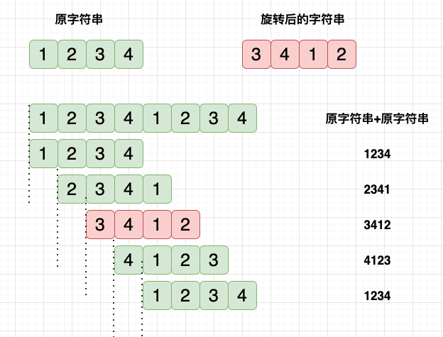
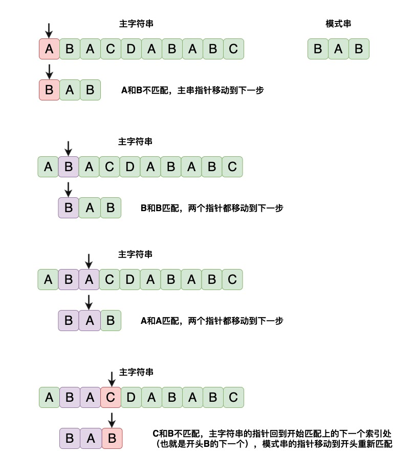
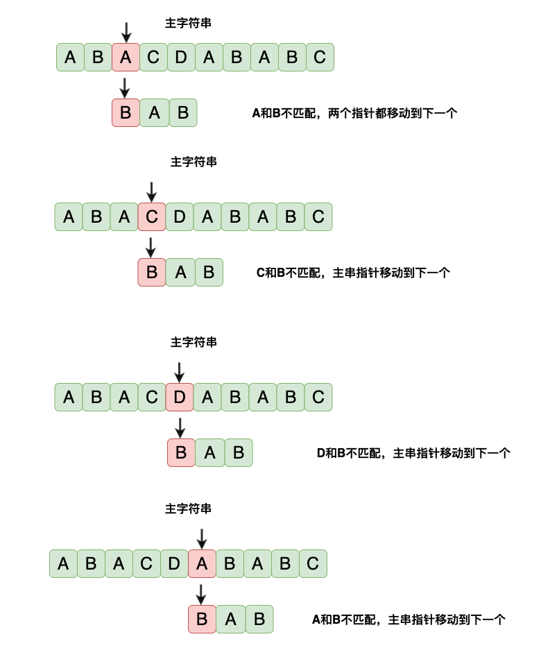
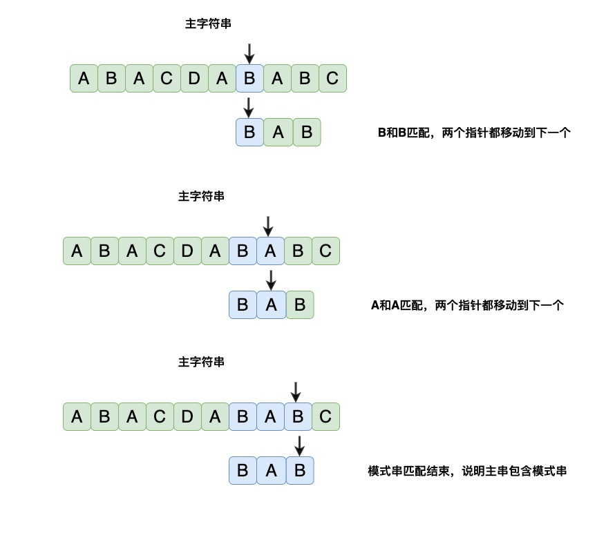
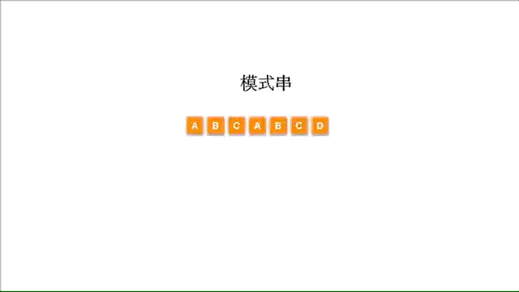

# 字符串操作
## 统计字符串中数字的次数
输入一个字符串（长度在 100 以内），统计其中数字字符出现的次数。例如输入 `Ab100cd200`，输出 6。

只需要接收输入，对字符串的每一个字符进行判断，判断字符是否在 `0 - 9` 之间，统计字符个数即可：
```java
public class CountOfNum {
    public static void main(String[] args) {
        Scanner scanner = new Scanner(System.in);
        String str = scanner.nextLine();
        long num = 0;
        num = str.chars().filter(c -> c >= '0' && c <= '9').count();
        System.out.println(num);
    }
}
```

## 替换空格为指定字符串
如果给定一个字符串，需要把其中的空格全部替换为 `CODE` 这样的字符串，可以直接通过标准库中的 `String.replaceAll()` 方法实现：
```java
str.replaceAll(" ", "CODE");
```
如果要自己实现数组插入的功能，需要：
1. 将字符串转换成为字符数组，遍历一次，统计出空格的个数
2. 构建出新的字符数组，初始化的大小 = 原来的字符数组长度 + 空格长度 x 3（空格是一个字符，CODE 是 4 个字符，替换一个空格增加了三个字符）。
3. 遍历一次，复制，当不为空格时直接复制，当为空格时，则把 CODE 这几个字符复制过去。

代码如下：
```java
public static String replaceSpace(String str) {
    // 转换为字符数组
    char[] origin = str.toCharArray();
    int spaceNum = 0;
    // 计算空格个数
    for(char c : origin)
        if(c == ' ')
            spaceNum++;
    // 创建新字符数组
    char[] result = new char[origin.length + spaceNum * 3];
    int index = 0;
    for(char c : origin) {
        if(c == ' ') {
            // 空格需要复制几个
            result[index++] = 'c';
            result[index++] = 'o';
            result[index++] = 'd';
            result[index++] = 'e';
        } else {
            // 直接复制
            result[index++] = c;
        }
    }
    // 转换为字符串
    return new String(result);
}
```

## 翻转句子中的单词
有一字符串 `I love coding`，要求将里面单词的顺序翻转，但是单词内部字母顺序不变，即翻转后为 `coding love I`。详细要求：
- 字符串的前后可能有空格，翻转之后字符串前后不允许出现空格。
- 单词之间可能存在多个空格，但是翻转之后统一为一个空格。
- 不能直接调用 `split()` 方法。

解答思路：
- 自定义 `split()` 方法，将字符串分割成若干个子串。
- 利用中心对称，将字符串转换成为倒序的。
- 遍历子串，去掉多余的空格，每个有效的子串后面增加一个空格。
- 去掉结果最后多余的空格。

代码如下：
```java
public class ReverseString {
    public static void main(String[] args) {
        String str = "I love coding every  day";
        System.out.println(reverse(str));
    }

    public static String reverse(String s) {
        // 按空格分隔
        String[] splits = split(s);
        int size = splits.length;
        // 根据轴对称进行交换
        for(int i = 0; i < size / 2; i++) {
            String temp = splits[i];
            splits[i] = splits[size - 1 - i];
            splits[size - 1 - i] = temp;
        }
        // 拼接字串
        StringBuilder sb = new StringBuilder();
        for(String str : splits) {
            // 去掉空字串
            if(!"".equals(str))
                sb.append(str).append(" ");
        }
        if(!sb.isEmpty())
            return sb.toString();
        return "";
    }

    public static String[] split(String str) {
        if(str == null || str.isEmpty())
            return new String[0];
        List<String> result = new ArrayList<>();
        StringBuilder sb = new StringBuilder();
        for(int i = 0; i < str.length(); i++) {
            if(str.charAt(i) == ' ') {
                result.add(sb.toString());
                sb = new StringBuilder();
            } else {
                sb.append(str.charAt(i));
            }
        }
        if(!sb.isEmpty())
            result.add(sb.toString());
        return result.toArray(new String[0]);
    }
}
```
算法的时间复杂度是 $O(n)$，空间复杂度也是 $O(n)$。

另外，如果没要求分割和 `split()` 方法一模一样，可以用 StringTokenizer 类：
```java
// StringTokenizer 可以根据指定的分隔符来分割字符串，而且默认就是按空格分割的
// 但遇到连续空格不会像split()那样，生成空字符串
public static String[] splitUseStringTokenizer(String str) {
    List<String> result = new ArrayList<>();
    StringTokenizer st = new StringTokenizer(str);
    while(st.hasMoreElements())
        result.add(st.nextToken());
    return result.toArray(new String[0]);
}
```

## 寻找最长回文子串
回文串是指不管是顺着读还是逆着读，都是一样的。判断一个字符串是否是回文串，根据中心对称判断即可。现在问题是一个字符串 s，找到 s 里面包含的最长的回文串。例如输入 `abdbdc`，输出 `dbd`。

直接的解法是对字符串的每一段子串判断，即将 `abdbdc` 分为子串：
- 以 a 开头的：a，ab，abd，abdb，abdbd，abdbdc。
- 以 b 开头的：b，bd，bdb，bdbd，bdbdc。
- 以 d 开头的：d，db，dbd，dbdc。
- 以 b 开头的：b，bd，bdc。
- 以 d 开头的：d，dc。
- 以 c 开头的：c。

对所有子串判断是否为回文串，然后记录最长的一个。代码如下：
```java
public class LongestPalindrome {
    public static void main(String[] args) {
        String s = "abdbdc";
        System.out.println(find_simple(s));
    }

    public static boolean isMatch(String s) {
        for(int i = 0; i < s.length(); i++) {
            if(s.charAt(i) != s.charAt(s.length() - 1 - i))
                return false;
        }
        return true;
    }

    // 三重循环的简单解法
    public static String find_simple(String str) {
        String result = "";
        int max = 0;
        int length = str.length();
        for(int i = 0; i < length; i++) {
            for(int j = i + 1; j <= length; j++) {
                String subStr = str.substring(i, j); // 注意不包含endIndex
                if(max < subStr.length() && isMatch(subStr)) {
                    // 记录回文串的最大长度
                    max = subStr.length();
                    result = subStr;
                }
            }
        }
        return result;
    }
}
```
该方法的时间复杂度是 $O(n^3)$，空间复杂度是 $O(1)$。

由于回文串的顺序和逆序相同，所以回文串都有一个中心，即对称轴，比如 abba，对称轴是两个 b 字符之间，abcba 的对称轴则是 c，也就是以下规律：
- 字符数为奇数的回文串的中心是一个字符。
- 字符数为偶数的回文串的中心是两个字符的间隙。

要兼容这两种情况，就需要设计一个方法，传入两个索引参数，如果两个参数相同，中心往两边拓展时，拓展出来的字符数是奇数。如果两个索引参数是相邻的两个数，那么拓展出来的字符数就是偶数。

优化后的实现如下：
```java
// 由中心向两边扩展的方法
public static String find_spread(String str) {
    if(str == null || str.length() < 2)
        return str;
    int max = 1;
    String result = str.substring(0, 1);
    for(int i = 0; i < str.length() - 1; i++) {
        // 中心为 i 的奇数个回文串
        String odd = spread(str, i, i);
        // 中心为 i 和 i+1 的偶数个回文串
        String even = spread(str, i, i + 1);
        // 选择两者最长的
        String maxStr = odd.length() > even.length() ? odd : even;
        if(max < maxStr.length()) {
            // 更新最长回文串
            max = maxStr.length();
            result = maxStr;
        }
    }
    return result;
}

public static String spread(String str, int left, int right) {
    int len = str.length();
    while(left >= 0 && right < len) {
        if(str.charAt(left) == str.charAt(right)) {
            left--;
            right++;
        } else {
            break;
        }
    }
    return str.substring(left + 1, right);
}
```
该方法在时间复杂度上，由于中心是 n，拓展的时候每个中心最多能把所有数拓展完，即 n/2 次，所以是 $O(n^2)$，而空间上，只有常数个临时变量，所以空间复杂度为 $O(1)$。还要其他比较巧妙的做法，比如动态规划。

## 字符串转整数
问题是：将给定字符串转换成为 32 位的有符号的整数，规则如下：
- 如果字符串的前面有空格，那么可以忽略
- 符号只能存在于数字前面，也就是类似“+3”，“-2”，而 “2-1” 则是只能读取到 2，后面不规则的需要忽略。
- 如果超过了 32 位有符号整数的范围，需要将其截断，大于 $2^{31}-1$ 则返回 $2^{31}-1$，小于 $-2^{31}$ 则返回 $-2^{31}$。

通过解析规则，可以得到步骤：
1. 去掉前面的空格
2. 接下来的字符必须是数字，`+`或`-`号
   1. 如果是`+`或`-`号，将符号记录下来
   2. 没有符号默认是正数
3. 接下来的字符必须是数字，遇到其他字符会直接结束
4. 考虑溢出问题

将字符串转换为数字时，可以循序遍历：
```java
sum = sum * 10 + (str.charAt(i) - '0');
```
判断溢出时，如果当前 sum 值大于 `Integer.MAX_VALUE/10`，即 214748364，此时后面还有数字则一定溢出；如果当前值等于 `Integer.MAX_VALUE/10`，就需要判断后面一个数字是否大于 7，若大于 7 也会溢出。
```java
public static int convert(String str) {
    if(str == null || str.isEmpty())
        return 0;
    int i = 0;
    // 忽略前面空格
    while(i < str.length() && str.charAt(i) == ' ')
        i++;
    char symbol = '+';
    // 判断紧接着的字符是否为正负号
    if(i < str.length() && str.charAt(i) == '-') {
        symbol = '-';
        i++;
    }
    if(i < str.length() && str.charAt(i) == '+') {
        i++;
    }
    int result = 0;
    // 从第一个数字开始，一直到最后一个数字
    while(i < str.length() && str.charAt(i) >= '0' && str.charAt(i) <= '9') {
        // 判断是否溢出
        if(result > 214748364 || (result == 214748364 && str.charAt(i) > '6')){
            result = Integer.MAX_VALUE;
            break;
        }
        result = result * 10 + str.charAt(i) - '0';
        i++;
    }
    if(symbol == '+')
        return result;
    else
        return -result;
}
```
执行只需遍历一遍，因此时间复杂度为 $O(n)$，空间复杂度为 $O(1)$。

## 拼接字符串找出最小数
输入一个正整数数组，把数组里所有数字拼接起来排成一个数，打印能拼接出的所有数字中最小的一个。例如输入 `{3，32，321}`，则打印出这三个数字能排成的最小数字为 321323。

题目要求字符串拼接后的数字最小，即排序问题。如果只有两个字符串 s1, s2，就需要比较 s1+s2 和 s2+s1，如果 s1+s2 小于 s2+s1，那么 s1 就在前面，s2 就在后面。

对于一个数组，要使所有的拼接起来是最小，则需要两两比较，进行排序即可。这种排序规则保证了任意相邻元素的组合都是局部最优的，从而整个序列的拼接结果全局最优。

可以直接调用自带的排序方法，代码如下：
```java
public static String minNumber(int[] nums) {
    String[] strs = new String[nums.length];
    for(int i = 0; i < nums.length; i++)
        strs[i] = String.valueOf(nums[i]);
    Arrays.sort(strs, (x, y) -> (x + y).compareTo(y + x));
    StringBuilder res = new StringBuilder();
    for(String s : strs)
        res.append(s);
    return res.toString();
}
```

## 旋转词之 KMP 算法
将某字符串 s1 的前面任意连续字符移动到该字符串后面，形成新字符串 s2，s2 即为 s1 的旋转字符串。如“1234”的旋转字符串有“1234”、“2341”、“3412”、“4123”。现给定两个字符串，判断它们是否是旋转字符串。

思路如下：
1. 首先判断 str1 和 str2 的字符串长度是否相等，若不等，返回false
2. 若长度相等，生成拼接字符串 str1 + str1 的大字符串 str
3. 问题转化为字符串的模式匹配，即判断一个字符串是否包含另一个字符串



用暴力解法的步骤如下：





代码如下：
```java
public class ContainTest {
    public static void main(String[] args) {
        System.out.println(isContain("ABDABC", "DAB"));
    }

    public static boolean isContain(String source, String pattern) {
        char[] sources = source.toCharArray();
        char[] patterns = pattern.toCharArray();
        // 主串索引
        int i = 0;
        // 模式串索引
        int j = 0;
        while(i < sources.length && j < patterns.length) {
            // 两个字符相等，比较下一个
            if(sources[i] == patterns[j]) {
                i++;
                j++;
            } else {
                // 不匹配时回溯到开始匹配的下一个索引
                i = i - j + 1;
                // 模式串从头开始
                j = 0;
            }
        }
        return j == patterns.length;
    }
}
```
暴力解法的弊端是不匹配时，每次都要从头开始匹配，优化的思路是回溯到合适的位置。KMP 通过构建部分匹配表（next 数组），使模式串在匹配失败时能跳过已匹配的部分，减少重复匹配的开销。

首先明确前缀指从头开始但不包含最后一个字符的所有子串，后缀指从尾部开始但不包含第一个字符的所有子串。

在模式串的第 i 个位置发生失配，说明前面 0 ~（i-1） 个字符是匹配的，即模式串和主串这部分是完全相同的，此时只需要找出已经匹配的字符里最长公共前后缀，将模式串移动到该位置即可。因为已经匹配的字符只和模式串有关，与主串无关，所以失配时，只需移动模式串就行。

用一个 next 数组记录模式串的子串的最长公共前后缀长度，即记录前面已经匹配的信息里面，有效的信息，让模式串尽量移动到有效的位置。例如模式串“ABABA”：

| 子串  | 前缀          | 后缀              | 最长前后子缀 | 最长公共前后缀长度 |
|-------|---------------|-------------------|--------------|--------------------|
| A     | 无            | 无                | 无           | 0                  |
| AB    | A             | B                 | 无           | 0                  |
| ABA   | A, AB         | A, BA             | A            | 1                  |
| ABAB  | A, AB, ABA    | B, AB, BAB        | AB           | 2                  |
| ABABA | A, AB, ABA, ABAB | A, BA, ABA, BABA | ABA          | 3                  |

假设 sources[i] 和 patterns[j] 处发生失配，已知 next[j]=k，说明 patterns[] 中前 j-1 个元素中，最长公共前后缀长度是 k，那么模式串 pattern[] 上的指针应该移动到第 k 个位置继续和主串 source[] 上的 i 继续比较。

KMP 算法包含两次匹配过程，一次是模式串和主串的匹配，另外一次是在求解模式串的 next[] 数组时，模式串的最长前缀子串和最长后缀子串的匹配。next 数组的求解代码如下：
```java
// 求模式串的最长前后缀匹配长度数组
public static void getNext(int[] next, String pattern) {
    int j = 0, k = -1;
    next[0] = -1;
    while(j < pattern.length() - 1) {
        if(k == -1 || pattern.charAt(j) == pattern.charAt(k)) {
            // 前后缀匹配，即next[j + 1] = k + 1
            k++;
            j++;
            next[j] = k;
        } else {
            // 不相等时，需要看前面已匹配的字符串的最长公共前后缀，即 next[k]
            k = next[k];
        }
    }
    System.out.println(Arrays.toString(next));
}
```
过程如下：


还有一种更现代化写法，初始化 `next[0]=0` 和 `j=0`，且利用循环手动回退：
```java
public static int[] findNext(String pattern) {
     int n = pattern.length();
     int[] next = new int[n];
     int j = 0; // 当前已匹配的前后缀长度
     for(int i = 1; i < n; i++) { // 表示长度为 i+1 的子串
         // 如果下一个字符不匹配，就回退 j 到 next[j-1]
         while(j > 0 && pattern.charAt(j) != pattern.charAt(i)) {
             j = next[j - 1];
         }
         // 如果匹配，就扩展前后缀
         if(pattern.charAt(j) == pattern.charAt(i)) {
             j++;
         }
         next[i] = j;
     }
     return next;
 }
```

下面用 `getNext()` 方法计算 next 数组，`kmp(String, String)` 调用 next[] 数组进行匹配回溯，`isMatch(String, String)` 主要是判断两个字符串是不是互为旋转词。
```java
public class KMPTest {
    public static void main(String[] args) {
        System.out.println(isMatch("1234", "3412")); // true
        System.out.println(isMatch("1234", "4312")); // false
        System.out.println(isMatch("ABCBD", "BDABC")); // true
        System.out.println(isMatch("ABCBDACB", "ABCDABDC")); // false
    }

    public static boolean isMatch(String strA, String strB) {
        if(strA.length() != strB.length())
            return false;
        // 拼接成为主串
        String bigStr = strA + strA;
        return kmp(bigStr, strB) != -1;
    }

    public static int kmp(String source, String pattern) {
        // next 数组，保存已匹配的字符串的最长公共前后缀
        int[] next = new int[pattern.length()];
        getNext(next, pattern);
        int i = 0;
        int j = 0;
        while(i < source.length() && j < pattern.length()) {
            if(j == -1 || source.charAt(i) == pattern.charAt(j)) {
                i++;
                j++;
            } else {
                // 模式串上的指针回溯到j位置
                j = next[j];
            }
        }
        return j == pattern.length() ? (i - j) : -1;
    }

    // 求模式串的最长前后缀匹配长度数组
    public static void getNext(int[] next, String pattern) {
        int j = 0, k = -1;
        next[0] = -1;
        while(j < pattern.length() - 1) {
            if(k == -1 || pattern.charAt(j) == pattern.charAt(k)) {
                // 前后缀匹配，即next[j + 1] = k + 1
                k++;
                j++;
                next[j] = k;
            } else {
                // 不相等时，需要看前面已匹配的字符串的最长公共前后缀，即 next[k]
                k = next[k];
            }
        }
        System.out.println(Arrays.toString(next));
    }
}
```
kmp 算法的空间复杂度为 `O(m)`，时间复杂度为 `O(n+m)`（计算 next[] 数组的时间复杂度 + 遍历比较的复杂度）。

## Rabin-karp 算法
判断一个字符串是否是另一字符串的子串，有比 kmp 更简单的算法，比如 Rabin-Karp 算法，其主要思想：
- 假设主串的长度为 M，目标字符串的长度为 N。
- 计算子串的 hash 值。
- 计算主串中每一个长度为 N 的连续子串的 hash 值，与子串的 hash 值对比。如果 hash 值不相等，那么则说明字符串肯定不匹配，如果 hash 值相等，则还需要使用朴素算法来判断。

如果两个不同的字符串出现 hash 相等情况，称为哈希冲突，但概率很低。

由于每一个字符有自己的 ASCII 码，我们可以设置一个进制为 b = 31， 假设字符为 $T = T_1T_2T_3...T_{n-1}T_n$，那么其 hash 值可以表示为：

$$Hash(T)=T_1b^{n-1}+T_2b^{n-2}+T_3b^{n-3}+\cdots+T_{n-1}b^{1}+T_n$$

由于 Java 中 long 值溢出后会自动绕回，所以不需要再对结果求余。
```java
public class RabinKarp {
    public static void main(String[] args) {
        System.out.println(isMatch("ABABCD", "BCD"));
    }

    public static boolean isMatch(String source, String pattern) {
        // 计算模式串的 hash
        long Phash = hash(pattern);
        int Plen = pattern.length();
        for(int i = 0; i + Plen <= source.length(); i++) {
            // 计算子串的 hash 值
            long tempHash = hash(source.substring(i, i + Plen));
            if(tempHash == Phash)
                return true;
        }
        return false;
    }

    public static long hash(String str) {
        long result = 0;
        for(int i = 0; i < str.length(); i++) {
            result += 31 * result + str.charAt(i);
        }
        return result;
    }
}
```
这里计算子串的 hash 时每次都重新计算了，所以可以针对 hash 值计算做优化，每次去掉开头字符的 hash 然后加上末位字符的 hash，这种优化称为滚动 hash，优化后的 `isMatch()` 如下：
```java
public static boolean isMatchRollHash(String source, String pattern) {
    long Phash = hash(pattern);
    int Plen = pattern.length();
    int Slen = source.length();

    long base = 1;
    for (int i = 1; i < Plen; i++) {
        base *= 31; // 计算 31^(Plen-1)
    }

    long tempHash = 0;
    if(Plen <= Slen) {
        tempHash = hash(source.substring(0, Plen));
    }
    for(int i = 0; i + Plen <= Slen; i++) {
        if(tempHash == Phash)
            return true;
        if(i + Plen < Slen)
            tempHash = (tempHash - source.charAt(i) * base) * 31 + source.charAt(i + Plen);
    }
    return false;
}
```

## 题目：字符统计
描述：给定一个长度为 n 的字符串 S，还有一个数字 L，统计长度大于等于 L 的出现次数最多的子串（不同的出现可以相交），如果有多个，输出最长的，如果仍然有多个，输出第一次出现最早的。

思路：枚举所有可能的子串，巧妙利用 hashmap，统计出现次数，key 是子串，value 是子串出现的次数，找出符合条件的那个：
```java
public static String statistics_ref(String str, int L) {
    int length = str.length();
    Map<String, Integer> map = new HashMap<>();
    String temp = "";
    int max = 0;
    String maxStr = "";
    for(int i = 0; i + L <= length; i++) {
        for(int j = i + L; j < length; j++) {
            temp = str.substring(i, j);
            // 若map中已有该字符串
            if(map.containsKey(temp)) {
                // 取出值
                int value = map.get(temp);
                value++;
                if(value > max) {
                    max = value;
                    maxStr = temp;
                } else if(value == max) {
                    if(temp.length() > maxStr.length()) {
                        maxStr = temp;
                    }
                }
                map.put(temp, value);
            } else {
                // 否则加进去
                map.put(temp, 0);
            }
        }
    }
    return maxStr;
}
```
也可以暴力遍历每一个子串，然后遍历其出现的次数。


