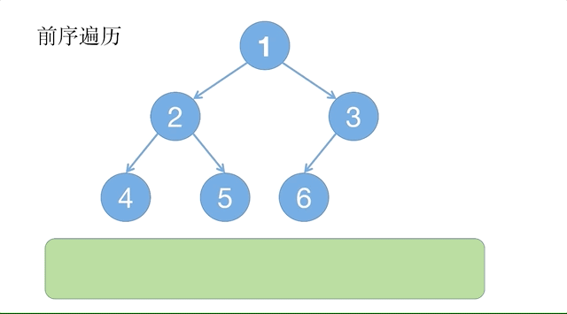
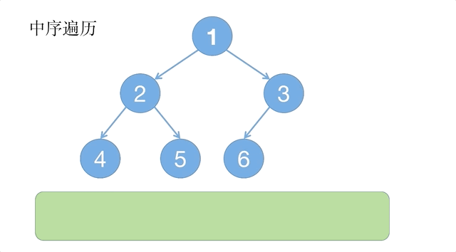
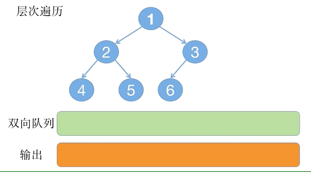

# 树结构
几种二叉树：
- 满二叉树：每一层的结点，都完全覆盖（全部有值），即每个非叶子结点都有两个字结点。
- 完全二叉树：除了最后一层以外，每一层的结点数都达到最大个数，最后一层的结点，都连续并且靠左。（满二叉树一定是完全二叉树，但是完全二叉树不一定是满二叉树）。
- 任意非空结点的左子树如果不为空，则左子树的值小于根结点的值，任意非空结点的右子树如果不为空，则右子树的值大于根结点的值，任意结点的左右子树都是二叉查找树，并且结点的数值互不相等。

二叉树的第 i 层至多有 $2^{i-1}$ 个结点，高度为 k 的二叉树最多结点数为：$1+2+4+...+2^{k-1}=2^k-1$。

## 遍历树
树的遍历有前序，中序，后序遍历：
- 前序遍历：对于每个结点，都先访问根结点（当前结点），再遍历左子树，最后遍历右子树。
- 中序遍历；对于每个结点（当前结点），先遍历左子树，再访问当前结点，最后遍历右子树。
- 后序遍历；对于每个结点（当前结点），先遍历左子树，在遍历右子树，最后访问当前结点。

前序遍历的动态过程如下：



前序遍历的递归实现如下：
```java
public static void preOrder_recur(TreeNode node) {
    if(node != null) {
        System.out.print(node.val + " ");
        // 访问左子树
        preOrder_recur(node.left);
        // 访问右子树
        preOrder_recur(node.right);
    }
}
```
若使用非递归，可以借助栈实现，先将根结点放入栈中，然后循环以下操作直到栈为空：
1. 取出栈顶第一个元素（结点），输出。
2. 如果栈顶的第一个结点的右结点不为空，那么将右结点压入堆栈。
3. 如果栈顶的第一个结点的左结点不为空，那么将左结点压入堆栈。

代码如下：
```java
public static void preOrder_stack(TreeNode node) {
    Deque<TreeNode> deque = new ArrayDeque<>();
    if(node != null) {
        deque.addFirst(node);
    }
    while(!deque.isEmpty()) {
        TreeNode top = deque.pop();
        System.out.print(top.val + " ");
        if(top.right != null) {
            deque.addFirst(top.right);
        }
        if(top.left != null) {
            deque.addFirst(top.left);
        }
    }
}
```
中序遍历的动态执行过程如下：



递归代码实现如下：
```java
public static void inOrder_recur(TreeNode node) {
    if(node != null) {
        inOrder_recur(node.left);
        System.out.print(node.val + " ");
        inOrder_recur(node.right);
    }
}
```
中序遍历的非递归方法，与前序类似，也是借助栈，思路为：若当前根结点不为空或者堆栈不为空，执行下面的循环：
1. 如果当前根节点不为空，执行循环：将当前结点压栈，并且当前结点引用置为其左结点。
2. 如果当前根节点为空，取出栈的第一个元素，也就是没有遍历过的最左的子结点，然后将当前结点引用置为其右结点，相当于访问了左子树和当前结点后，紧接着访问右子树。

代码如下：
```java
public static void inOrder_stack(TreeNode node) {
    Deque<TreeNode> stack = new ArrayDeque<>();
    while(node != null || !stack.isEmpty()) {
        while (node != null) {
            stack.offerFirst(node);
            node = node.left;
        }
        node = stack.pop();
        System.out.print(node.val + " ");
        node = node.right;
    }
}
```
后序遍历的递归方法只是与前面的顺序不同：
```java
public static void postOrder_recur(TreeNode node) {
    if(node != null) {
        postOrder_recur(node.left);
        postOrder_recur(node.right);
        System.out.print(node.val + " ");
    }
}
```
后序遍历的非递归方法也是借助栈，不同的是还需要一个双向链表，堆栈压入的时候，先压入根结点，再左结点，最后是右结点。弹出时就是先右结点，再左结点，插入双向链表的时候，往头部插入，所以仍旧保持了左，右，中的顺序。动态执行过程如下：


代码如下：
```java
public static void postOrder_deque(TreeNode node) {
    if(node == null) return;
    Deque<TreeNode> stack = new ArrayDeque<>();
    Deque<Integer> deque = new ArrayDeque<>();
    // 先加入根节点
    stack.offerFirst(node);
    while(!stack.isEmpty()) {
        TreeNode top = stack.pop();
        deque.offerFirst(top.val);
        // 先压入左边，再压入右边，出栈的时候，就会先右边再左边
        if(top.left != null)
            stack.offerFirst(top.left);
        if(top.right != null)
            stack.offerFirst(top.right);
    }
    deque.forEach(item -> System.out.print(item + " "));
}
```

## 层次遍历
现希望能够从上往下打印出二叉树的每个结点，同层结点从左至右打印，也就是按照层次来遍历。

可以借助队列，针对每一个元素（譬如从根节点开始），先把当前元素放进队列尾部，然后不断取出队列头部的元素，取出元素的时候，同时处理其左子树和右子树，将其放到队列尾部，处理直到队列为空。动态过程如下：



队列用 LinkedList 实现，分别使用 `offer()` 和 `poll()` 方法添加和取出操作，代码如下：
```java
public static List<Integer> directPrint(TreeNode root) {
    if(root == null) return new ArrayList<>();
    Queue<TreeNode> queue = new LinkedList<>();
    List<Integer> res = new ArrayList<>();
    queue.offer(root);
    while(!queue.isEmpty()) {
        TreeNode top = queue.poll();
        res.add(top.val);
        if(top.left != null) queue.offer(top.left);
        if(top.right != null) queue.offer(top.right);
    }
    return res;
}
```
如果需要统计每一层的节点数，或者每一层分开输出，就需要每一层的遍历结束之时，统计双向队列中的元素个数，按照个数来遍历，而不是一直遍历到双向队列为空：
```java
public static Map<Integer, List<Integer>> levelPrint_dsOptimized(TreeNode root) {
    if(root == null) return new HashMap<>(); // 防止NPE
    // 使用 Queue，不需要双端队列 Deque
    Queue<TreeNode> queue = new LinkedList<>();
    Map<Integer, List<Integer>> res = new LinkedHashMap<>(); // 保持层级顺序
    int level = 0;
    queue.offer(root);
    while(!queue.isEmpty()) {
        int size = queue.size(); // 用size变量代替临时队列
        List<Integer> values = new ArrayList<>(size);
        for(int i = 0; i < size; i++) {
            TreeNode top = queue.poll();
            values.add(top.val);
            if(top.left != null) queue.offer(top.left);
            if(top.right != null) queue.offer(top.right);
        }
        res.put(level++, values);
    }
    return res;
}
```
时间复杂度为 $O(n)$，由于借助了额外的队列空间来存储结点信息，空间复杂度也为 $O(n)$。

## 根据遍历顺序重构二叉树
现假设给出了某二叉树的前序遍历和中序遍历的结果，需要重新构建出二叉树，返回其根节点。如：
```
前序遍历序列: {1，2，4，7，3，5，6，8}
中序遍历序列: {4，7，2，1，5，3，8，6}
```
前序序列中的特征是，第一个元素就是根节点，后面的元素就是左右子树的节点，但哪些是左子树或右子树不能得出。确定根节点后，从中序遍历中，查找根节点的位置，将序列分成左右两组，左边就是左子树，右边就是右子树，查找到根结点的时候，统计了左子树上结点的数量，以及右子树上结点的数量。再用左右结点的数量，按照前序遍历序列，就可以拆出来左右子树。

对于左右子树，分别看作两个子问题，解法与原问题一样，不断递归，直到两个区间无效（即起始位置大于结束位置）。

构建成功后，用前序遍历验证：
```java
public class ReBuildTree {
    public static void main(String[] args) {
        int[] preOrder = {1, 2, 4, 7, 3, 5, 6, 8};
        int[] inOrder = {4, 7, 2, 1, 5, 3, 8, 6};
        TreeNode root = buildBinaryTree(preOrder, inOrder);
        PreOrder.preOrder_stack(root);
    }

    // 根据前序遍历结果和中序遍历结果重建二叉树
    public static TreeNode buildBinaryTree(int[] preOrder, int[] inOrder) {
        if(preOrder == null || preOrder.length == 0 || inOrder == null || inOrder.length == 0)
            return null;
        Map<Integer, Integer> inMap = new HashMap<>();
        for(int i = 0; i < inOrder.length; i++) {
            inMap.put(inOrder[i], i);
        }
        return buildBinaryTree(preOrder, 0, preOrder.length - 1,
                inOrder, 0, inOrder.length - 1, inMap);
    }

    // inOrder参数实际多余
    private static TreeNode buildBinaryTree(int[] preOrder, int preStart, int preEnd,
                                            int[] inOrder, int inStart, int inEnd,
                                            Map<Integer, Integer> inMap) {
        if(preStart > preEnd || inStart > inEnd) return null;
        int rootVal = preOrder[preStart];
        TreeNode root = new TreeNode(rootVal);

        int rootIndex = inMap.get(rootVal);
        // 左子树结点数量
        int leftSize = rootIndex - inStart;

        root.left = buildBinaryTree(preOrder, preStart + 1,
                preStart + leftSize, inOrder, inStart, rootIndex - 1, inMap);
        root.right = buildBinaryTree(preOrder, preStart + leftSize + 1,
                preEnd, inOrder, rootIndex + 1, inEnd, inMap);
        return root;
    }
}
```
中序遍历搭配后序遍历结果也可以重建二叉树，但是前序和后序遍历无法重建，因为前序构建出来的结果可以有多种，只知道根结点，而后序遍历也一样，只知道最后一个元素为根结点，无法区分左右子树。所以就需要中序遍历加以区分。

## 二叉树的深度
根据一棵二叉树的根节点，求该树的深度。即求从根结点到叶结点依次经过的结点（含根、叶结点）形成的最长路径。

首先是递归方法，对于任意一个结点的高度，都可以表示为左子树和右子树中的最大高度加一，终止条件是当前结点为空：
```java
public static int treeDepth_recur(TreeNode root) {
    if(root == null) return 0;
    return Math.max(treeDepth_recur(root.left), treeDepth_recur(root.right)) + 1;
}
```
使用非递归，需要借助额外空间，使用层次遍历方法，计算层数就是树的深度。使用一个队列，分别将每一层的所有结点入队，然后每次循环中将这些结点移除，并将它们的子节点入队，然后进入下次循环，这样当队列为空时，循环结束，就可以得到树的层数，即深度：
```java
public static int treeDepth_queue(TreeNode root) {
    if(root == null) return 0;
    Queue<TreeNode> queue = new LinkedList<>();
    queue.offer(root);
    int depth = 0; // 初始为0，循环中就不需要进行判断
    while(!queue.isEmpty()) {
        int size = queue.size();
        for(int i = 0; i < size; i++) {
            TreeNode node = queue.poll();
            if(node.left != null) {
                queue.offer(node.left);
            }
            if(node.right != null) {
                queue.offer(node.right);
            }
        }
        depth++;
    }
    return depth;
}
```

## 镜像二叉树
假设有一个二叉树，现要将其变换为原二叉树的镜像。可以直接使用递归，从根节点开始，交换两个子节点，然后一直到叶子节点结束：
```java
public static void mirror(TreeNode root) {
    if(root != null && (root.left != null || root.right != null)) {
        TreeNode temp = root.left;
        root.left = root.right;
        root.right = temp;
        mirror(root.left);
        mirror(root.right);
    }
}
```
也可以先对子树递归反转，再交换当前左右子树的指针：
```java
public static void mirror(TreeNode root) {
    if (root == null) return;
    else reverse(root);
}

public static TreeNode reverse(TreeNode root) {
    if (root == null) return null;
    TreeNode left = reverse(root.right);  // 递归处理右子树
    TreeNode right = reverse(root.left);  // 递归处理左子树
    root.left = left;        // 左指针指向处理后的右子树
    root.right = right;      // 右指针指向处理后的左子树
    return root;
}
```
也有非递归的方法，可以使用队列或栈，进行按层遍历或深度遍历的方式处理所有结点：
```java
// 这里用队列或栈都行，只是一个是按层遍历，一个是深度优先
public static void mirror_queue(TreeNode root) {
    if(root == null) return;
    Queue<TreeNode> queue = new LinkedList<>();
    queue.offer(root);
    while(!queue.isEmpty()) {
        TreeNode node = queue.poll();
        TreeNode temp = node.left;
        node.left = node.right;
        node.right = temp;
        if(node.left != null) queue.offer(node.left);
        if(node.right != null) queue.offer(node.right);
    }
}
```

## 树的子结构
如何判断一棵二叉树，是不是另外一棵二叉树的子树？（空树不是任意一个树的子结构）

可以先找到相同的根节点，然后递归判断左子树和右子树即可。判断结点是不是相等时，如果子树遍历完成，则返回 true；其他情况，除非两个结构的结点都不为空且相等时，才返回 true，否则返回 false：
```java
public static boolean isSubTree_ds(TreeNode root1, TreeNode root2) {
    if(root1 == null || root2 == null)
        return false;
    if(isSameTree_ds(root1, root2))
        return true;
    else
        return isSubTree_ds(root1.left, root2) || isSubTree_ds(root1.right, root2);
}

private static boolean isSameTree_ds(TreeNode root1, TreeNode root2) {
    if(root1 == null && root2 == null) // 遍历结束
        return true;
    if(root1 == null || root2 == null)
        return false;
    return root1.val == root2.val && isSameTree_ds(root1.left, root2.left)
            && isSameTree_ds(root1.right, root2.right);
}
```

## 不同结点的最近公共父节点
给定一个二叉树上两个节点，找它们的最近公共祖先（LCA）。

优先选择的是递归法，通过从下往上检查的方式找到 p 和 q 的最低公共祖先。它的逻辑可以概括为：
- 如果当前节点是 p 或 q，或者为空，直接返回当前节点。
- 否则，递归地在左子树和右子树中寻找 p 和 q。
- 根据左右子树的返回值，判断最低公共祖先是当前节点还是在某个子树中。

代码如下：
```java
public static TreeNode lowestCommonAncestor(TreeNode root, TreeNode p, TreeNode q) {
    // 若当前节点为空，或者等于p或q，直接返回当前节点
    if(root == null || p == root || q == root)
        return root;
    TreeNode left = lowestCommonAncestor(root.left, p, q);
    TreeNode right = lowestCommonAncestor(root.right, p, q);

    if(left != null && right != null)
        return root;
    return left == null ? right : left;
}
```
首先，对于终止条件，如果当前节点为空，说明搜索到了树的边界，返回 null。如果当前节点就是 p 或 q，直接返回这个节点。这是因为：
- 如果找到了其中一个目标节点，当前节点可能是 LCA（如果另一个节点在它的子树中）。
- 如果当前节点就是其中一个目标节点，那么它至少是自己的祖先。

第二步，递归调用，分别在左右子树中寻找 p 和 q，返回值可能是：
- null：子树中没有找到 p 或 q。
- p 或 q：子树中找到了其中一个节点。
- 某个祖先节点：子树中包含 p 和 q，返回它们的 LCA。

最后，合并结果，当左右子树都返回非空结果，说明 p 和 q 分别位于当前节点的左右子树中。此时，当前节点 root 就是最低公共祖先。当左子树返回 null，说明 p 和 q 都不在左子树中，那么 LCA 一定在右子树中，返回 right，反之亦然。

另外还有路径记录法，即找到根节点到两个节点的路径，然后遍历两条路径，找到最后一个公共节点：
```java
public static TreeNode findUseCommonTrace(TreeNode root, TreeNode first, TreeNode second) {
    List<TreeNode> firstTrace = NodeTrace.trace(root, first);
    List<TreeNode> secondTrace = NodeTrace.trace(root, second);
    int min = Math.min(firstTrace.size(), secondTrace.size());
    TreeNode common = null;
    for(int i = 0; i < min; i++) {
        if(firstTrace.get(i).val == secondTrace.get(i).val)
            common = firstTrace.get(i);
    }
    return common;
}

public static List<TreeNode> trace(TreeNode root, TreeNode node) {
    List<TreeNode> res = new ArrayList<>();
    if(root == null || node == null) return res;
    findPath(root, node, res);
    return res;
}

private static boolean findPath(TreeNode current, TreeNode target, List<TreeNode> path) {
    if(current == null) return false;
    path.add(current);
    if(current == target) return true;
    if(findPath(current.left, target, path) || findPath(current.right, target, path))
        return true;
    // 若该节点的左右子树都没找到，就回溯
    path.removeLast();
    return false;
}
```
还有父节点哈希法，构建父节点映射重构路径：
```java
 public static TreeNode findUseParentHash(TreeNode root, TreeNode p, TreeNode q) {
    if(root == null) return null;
    Map<TreeNode, TreeNode> parentMap = new HashMap<>();
    Deque<TreeNode> stack = new LinkedList<>();
    stack.push(root);
    parentMap.put(root, null);
    while(!parentMap.containsKey(p) || !parentMap.containsKey(q)) {
        TreeNode top = stack.pop();
        if(top.left != null) {
            stack.push(top.left);
            parentMap.put(top.left, top);
        }if(top.right != null) {
            stack.push(top.right);
            parentMap.put(top.right, top);
        }
    }
    Set<TreeNode> ancestors = new HashSet<>();
    while (p != null) {
        ancestors.add(p);
        p = parentMap.get(p);
    }
    while(!ancestors.contains(q))
        q = parentMap.get(q);
    return q;
}
```
递归法的时间复杂度是 $O(n)$，空间复杂度 $O(h)$（树高），适合大多数情况。路径法需要额外空间存储路径，适合树较小的情况。父指针法需要两次遍历，但回溯效率高，适合多次查询的场景。

## 树的路径求和
一般二叉树上的每个结点都存储着自己的数据，该数据可能是数字，也可能是其他。假设有一个二叉树和一个整数，要求按字典顺序打印出二叉树中结点值的和为输入整数的所有路径。路径就是从树的根结点开始往下一直到叶结点所经过的结点形成一条路径。

思路是遍历二叉树的所有路径，找到所有符合要求的路径，添加到结果集，最后返回该结果集：
```java
public static List<List<Integer>> findPath(TreeNode root, int target) {
    List<List<Integer>> paths = new ArrayList<>();
    if(root == null) return paths;
    Deque<TreeNode> queue = new LinkedList<>();
    int sum = 0;
    findPath(root, target, sum, queue, paths);
    return paths;
}

private static void findPath(TreeNode root, int target, int sum,
                                            Deque<TreeNode> queue, List<List<Integer>> paths) {
    if(root != null) {
        sum += root.val; // 累加路径
        queue.push(root);
        // 若和满足且为叶子结点
        if(sum == target && root.left == null && root.right == null) {
            // 添加路径到结果集合
            paths.add(new ArrayList<>(queue.stream()
                    .map(n -> n.val)
                    .toList()
                    .reversed()));
        } else {
            findPath(root.left, target, sum, queue, paths);
            findPath(root.right, target, sum, queue, paths);
        }
        // 处理完一条路径，回溯到上一结点
        queue.pop();
        sum -= root.val;
    }
}
```
首先初始化一个队列和一个结果列表，然后调用辅助函数递归处理。递归的过程：每次访问一个节点，将其值加到sum里，并将节点加入队列。然后检查是否满足条件（sum等于target且是叶子节点），如果满足，就把当前队列里的节点值作为一条路径加入结果列表。否则，继续递归处理左右子节点。处理完之后，需要将当前节点从队列中移除，并恢复sum的值，也就是减去当前节点的值。

## 平衡二叉树
平衡二叉树的定义是每个节点的左右子树高度差不超过1，且左右子树本身也是平衡的。判断一个二叉树是否是平衡二叉树，可以先计算出左右子树的高度，判断两个相差是否大于1，如果满足，则不是平衡二叉树，若不满足，需要递归判断两个子树是否是平衡树。

这个简单的判断方法实现如下；
```java
public static boolean isBalanced_ref(TreeNode root) {
    if(root != null) {
        int left = deep(root.left);
        int right = deep(root.right);
        if(Math.abs(left - right) > 1)
            return false;
        else {
            return isBalanced_ref(root.left) && isBalanced_ref(root.right);
        }
    }
    return true;
}

private static int deep(TreeNode root) {
    if(root == null)
        return 0;
    return Math.max(deep(root.left), deep(root.right)) + 1;
}
```
但该方法比较低效，对每个节点递归计算深度时重复遍历子树（例如根节点计算完左右子树深度后，递归检查子树时又会重复计算）。

可以通过自底向上的递归方法高效地实现，具体步骤如下：
1. 递归计算子树高度并检查平衡性：从叶子节点开始，递归计算每个节点的左右子树高度。若某个子树不平衡，直接返回-1，避免重复计算。
2. 提前终止递归：若左子树或右子树已不平衡，立即返回-1，无需继续计算。
3. 比较高度差：对于每个节点，若左右子树高度差超过1，则返回-1；否则返回当前子树的高度。

自底向上递归的实现如下：
```java
public static boolean isBalanced(TreeNode root) {
    return checkHeight(root) != -1;
}

private static int checkHeight(TreeNode root) {
    if (root == null) return 0;
    int left = checkHeight(root.left);
    if (left == -1) return -1; // 左子树不平衡，提前终止
    int right = checkHeight(root.right);
    if (right == -1) return -1; // 右子树不平衡，提前终止
    if (Math.abs(left - right) > 1) return -1; // 当前节点不平衡
    return Math.max(left, right) + 1; // 返回当前子树高度
}
```
这样每个结点仅访问一次，一旦发现子树不平衡，立即向上返回-1，避免后续无意义计算。

